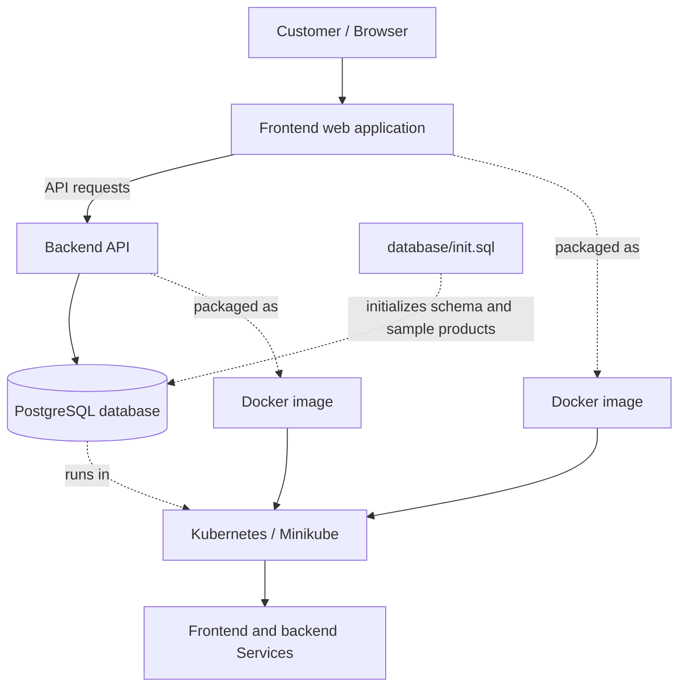

<div align="center">

# 🛋️ Go Furniture — Full-Stack E-Commerce Application

### A furniture shopping web application with a frontend, backend API, PostgreSQL database, Docker containers, and Kubernetes deployment.

[](https://github.com/bevararaghu5-netizen)
[](https://www.docker.com/)
[](https://kubernetes.io/)
[](https://www.postgresql.org/)

</div>

---

## 📌 Project Overview

**Go Furniture** is a full-stack furniture shopping application. It combines a browser-based frontend, a backend API, and a PostgreSQL database containing product records. The project was containerized with Docker and deployed locally to Kubernetes using Minikube.

The application includes a product catalogue populated from PostgreSQL. The database initialization script is located at `database/init.sql`; during development, it was used to create the products table and insert eight sample furniture products.

> **Project accuracy note:** This README documents the components and work known to exist in the project. Keep the technology badges and deployment claims only if they still match your current repository. The exact framework versions, endpoint list, Kubernetes manifest filenames, and deployment automation should be documented from the actual files rather than guessed.

## ✨ Features

- Furniture product catalogue displayed in the frontend.
- Backend API used by the frontend to retrieve product data.
- PostgreSQL database for product records.
- Database initialization script at `database/init.sql`.
- Docker images for the frontend and backend.
- Kubernetes resources for the frontend, backend, and PostgreSQL database.
- Local deployment and testing with Minikube.
- Nginx frontend routing/proxy configuration for API requests, as used in the project setup.

## 🧱 Architecture



The diagram is a conceptual view of the components. Use the actual Kubernetes YAML files in the repository to confirm the final service names, ports, replica counts, and image tags.

## 🧰 Technology Stack

| Technology | Purpose |
|---|---|
| Frontend | User interface and product catalogue |
| Backend API | Handles application/API requests |
| PostgreSQL | Stores furniture product records |
| SQL | Database schema and sample data initialization |
| Docker | Packages application components into container images |
| Kubernetes | Runs and connects application workloads |
| Minikube | Local Kubernetes cluster for development/testing |
| kubectl | Applies Kubernetes manifests and inspects resources |
| Nginx | Serves the frontend and handles API proxying in the configured setup |
| Git and GitHub | Source control and project hosting |

Update the frontend and backend rows with their exact frameworks (for example, React or Node.js/Express) only after confirming them in the repository's package/configuration files.

## 🗂️ Repository Structure

The following is a recommended presentation structure. Keep your existing files and folder names; do not move files just to match this example.

```text
go-furniture-full-stack/
├── README.md
├── frontend/
│   ├── Dockerfile
│   └── ... frontend source and configuration
├── backend/
│   ├── Dockerfile
│   └── ... backend source and configuration
├── database/
│   └── init.sql
├── k8s/                         # Use your real manifest folder name
│   ├── ... frontend resources
│   ├── ... backend resources
│   └── ... PostgreSQL resources
├── screenshots/
│   ├── 01-home-page.png
│   ├── 02-products-visible.png
│   ├── 03-kubernetes-pods.png
│   ├── 04-kubernetes-services.png
│   └── 05-database-products.png
└── docs/
    └── architecture.md
```

If your manifests are stored in a folder other than `k8s/`, keep that original path and update the commands below accordingly. Add a `docker-compose.yml` only if one already exists or you deliberately create and test it.

## 🗃️ Database

The SQL initialization file is:

```text
database/init.sql
```

In the development setup, the script created the products table and inserted eight sample products:

- Modern Sofa
- King Size Bed
- Accent Chair
- Storage Cabinet
- Dining Table
- Office Desk
- Bookshelf
- Coffee Table

To inspect the script before running it, open `database/init.sql` and verify the database name, table names, and SQL statements. Run it only against the intended development database; avoid re-running seed inserts blindly if the script does not protect against duplicates.

## 🐳 Docker

Docker images were built for the frontend and backend during the project work. Image tags used during frontend builds included:

```text
raghu434/go-furniture-frontend:1.0
raghu434/go-furniture-frontend:1.1
raghu434/go-furniture-frontend:1.2
```

Use the exact image names and tags currently referenced in your Kubernetes manifests. Do not assume the latest tag is deployed without checking.

Useful commands:

```powershell
docker images
docker ps
```

If the frontend is built from the `frontend` directory, run the build command from the repository root using the path that matches your actual Dockerfile:

```powershell
docker build -t raghu434/go-furniture-frontend:1.2 .\frontend
```

Only run this example if that tag is the one you intend to build and your current frontend Dockerfile is still in `frontend/`.

## ☸️ Kubernetes and Minikube

The project was run locally on Minikube with Kubernetes workloads for the frontend, backend, and PostgreSQL database.

First confirm that Minikube is running and the expected context is active:

```powershell
minikube status
kubectl config current-context
kubectl get nodes
```

Inspect resources:

```powershell
kubectl get deployments
kubectl get pods
kubectl get services
kubectl get pods -A
```

To apply manifests, use the directory and filenames that actually exist in your repository. For example, only if your manifest directory is named `k8s`:

```powershell
kubectl apply -f .\k8s\
```

Check application logs using the real pod name or a matching label selector:

```powershell
kubectl logs <pod-name>
kubectl describe pod <pod-name>
```

Replace `<pod-name>` with a real pod name from `kubectl get pods`. Do not paste the placeholder literally.

## 🌐 Frontend and API troubleshooting

If the page opens but products do not appear, check the entire data path:

1. Confirm the PostgreSQL pod is running.
2. Confirm the products table contains records.
3. Check backend logs for SQL or connection errors.
4. Test the backend API from the appropriate in-cluster or forwarded endpoint.
5. Check frontend Nginx proxy configuration and the browser's Network/Console tabs.
6. Confirm the deployed frontend image is the expected tag and that Kubernetes is running that image.

Useful commands:

```powershell
kubectl get pods
kubectl get services
kubectl logs <backend-pod-name>
kubectl logs <postgres-pod-name>
```

Use the actual pod names shown by `kubectl get pods`, or use selectors if your manifests define stable labels.

## 🖼️ Screenshots

Add genuine screenshots captured from your own working application and cluster to the `screenshots/` directory.

| File | What it should show |
|---|---|
| `01-home-page.png` | Go Furniture home page in a browser |
| `02-products-visible.png` | Product catalogue with product cards visible |
| `03-kubernetes-pods.png` | `kubectl get pods` showing frontend, backend, and PostgreSQL workloads ready |
| `04-kubernetes-services.png` | `kubectl get services` showing the project's services |
| `05-database-products.png` | A query result showing sample product rows; hide credentials and sensitive information |

After adding screenshots, embed them in this README:

```markdown
## 📸 Application Preview


## 🛍️ Product Catalogue


## ☸️ Kubernetes Workloads


```

The filenames are a checklist; this pack does not contain fabricated application screenshots.

## 🧠 What I Learned

- Connecting a frontend to a backend API and PostgreSQL data.
- Initializing a relational database with SQL.
- Building and tagging Docker images for application components.
- Deploying frontend, backend, and database workloads on Kubernetes.
- Inspecting pods, services, deployments, and application logs with `kubectl`.
- Troubleshooting missing product data across the database, backend, frontend, and Nginx proxy.

## 🔒 Security and Good Practices

- Never commit database passwords, API secrets, access tokens, private keys, or credential files.
- Keep real credentials out of screenshots and logs.
- Use Kubernetes Secrets or an appropriate secret manager for credentials; do not hard-code production secrets into manifests.
- Avoid committing generated dependencies, local build outputs, and machine-specific configuration unless needed.
- Document only commands and deployment steps that have been tested in your environment.

## 👨‍💻 Author

**Raghunadh Bevara**

- GitHub: [bevararaghu5-netizen](https://github.com/bevararaghu5-netizen)

---

*This project was built as a hands-on full-stack and containerization/Kubernetes learning project.*
