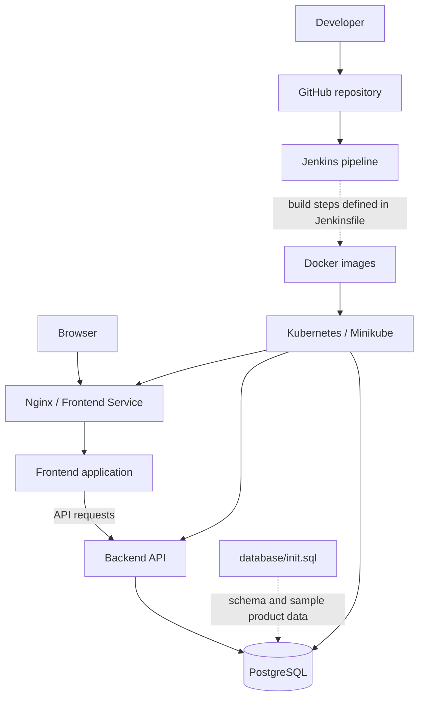

<div align="center">

# 🛋️ Go Furniture — DevOps Deployment

### Containerized Full-Stack Application with Docker, Kubernetes, Jenkins, and PostgreSQL

[](https://www.docker.com/)
[](https://kubernetes.io/)
[](https://www.jenkins.io/)
[](https://www.postgresql.org/)
[](https://nginx.org/)

**A hands-on DevOps project** focused on packaging, deploying, exposing, and troubleshooting a full-stack furniture catalogue application.

</div>

---

## 📌 Project Overview

Go Furniture is a full-stack furniture catalogue application with a frontend, backend API, and PostgreSQL database. This repository also contains deployment and infrastructure files used to containerize the application and run it in a local Kubernetes environment.

The DevOps focus of this project is to:
- Build container images for application components.
- Configure frontend-to-backend communication through Nginx/API routing.
- Run frontend, backend, and PostgreSQL workloads on Kubernetes.
- Initialize and validate product data in PostgreSQL.
- Use Kubernetes commands to inspect deployments, pods, services, and logs.
- Maintain a Jenkins pipeline definition and Docker Compose configuration in the repository.

> **Scope and accuracy:** The repository contains a `Jenkinsfile`, `docker-compose.yml`, Kubernetes manifests in `K8s/`, and an `nginx/` directory. The presence of these files does not by itself prove that every pipeline stage is currently passing or that deployment is fully automated. Use the screenshots and pipeline results from your latest successful run to show which steps are verified.

## 🏗️ Architecture



The diagram represents the component relationships. Verify the actual pipeline stages, image names, ports, selectors, and resource names against `Jenkinsfile`, `K8s/`, `frontend/`, `backend/`, and `nginx/` before describing any connection as automated.

## 🎯 DevOps Objectives

- **Containerization:** Package application components into Docker images.
- **Orchestration:** Define Kubernetes workloads and Services using YAML.
- **Application networking:** Route browser traffic to the frontend and API requests to the backend.
- **Database initialization:** Create the product schema and populate sample data using SQL.
- **CI/CD practice:** Keep the Jenkins pipeline definition under version control.
- **Troubleshooting:** Diagnose issues across frontend routing, backend API responses, database contents, and Kubernetes resources.

## 🧰 Technology Stack

| Tool / Component | Purpose |
|---|---|
| Git and GitHub | Source control and repository hosting |
| Jenkins | Pipeline definition and build/deployment orchestration |
| Docker | Builds and runs container images |
| Kubernetes | Runs application and database workloads |
| Minikube | Local Kubernetes cluster used during development |
| kubectl | Applies manifests and inspects cluster resources |
| Nginx | Serves/proxies frontend traffic according to the repository configuration |
| PostgreSQL | Stores furniture product data |
| SQL | Initializes database schema and sample records |
| Docker Compose | Local multi-container configuration, as defined in `docker-compose.yml` |

Check the actual frontend/backend package files to name their specific frameworks and versions accurately.

## 📁 Repository Structure

```text
go-furniture/
├── K8s/                 # Kubernetes manifests
├── backend/             # Backend API source and Docker configuration
├── database/            # Database initialization files
├── docs/                # Project documentation
├── frontend/            # Frontend source and Docker configuration
├── nginx/               # Nginx configuration
├── screenshots/         # Project screenshots
├── .gitignore
├── Jenkinsfile          # Jenkins pipeline definition
├── docker-compose.yml   # Multi-container configuration
├── LICENSE
└── README.md
```

This is based on the folder names currently visible in the repository. The exact filenames inside each directory should be documented from the checked-in files.

## 🔄 Deployment Workflow

1. **Source control:** Keep application code and infrastructure definitions in GitHub.
2. **Build/containerize:** Build Docker images using the Dockerfiles in the application directories.
3. **Configure networking:** Use the repository's Nginx configuration for frontend delivery and API routing.
4. **Deploy workloads:** Apply the Kubernetes YAML files from `K8s/` to the intended cluster.
5. **Initialize data:** Use the SQL file in `database/` to initialize the PostgreSQL schema and sample product data, following the project's database configuration.
6. **Validate:** Inspect pod readiness, services, application logs, API responses, and the browser product catalogue.
7. **Pipeline validation:** Run Jenkins and document the actual result of each stage. Only label CI/CD as successful after a successful run is captured.

## 🐳 Docker

From the project root, first inspect the available configuration:

```powershell
Get-ChildItem
Get-ChildItem .\frontend
Get-ChildItem .\backend
```

Build commands depend on the actual Dockerfile paths. For example, if the frontend Dockerfile is at `frontend/Dockerfile`:

```powershell
docker build -t raghu434/go-furniture-frontend:1.2 .\frontend
```

Use the tag referenced by your current Kubernetes manifests; do not assume that `1.2` is the deployed tag.

Useful inspection commands:

```powershell
docker images
docker ps
```

If you use Docker Compose, inspect the existing file first and then use the service names defined there:

```powershell
docker compose config
docker compose up --build
```

Run Compose only if its environment variables, image settings, and ports are configured for your machine.

## ☸️ Kubernetes Deployment

The repository's Kubernetes directory is named **`K8s/`** (uppercase K), so use that path in PowerShell.

Check the cluster:

```powershell
minikube status
kubectl config current-context
kubectl get nodes
```

Review the manifest filenames before applying them:

```powershell
Get-ChildItem .\K8s
```

Apply the manifests in that directory, if they are all intended to be deployed together:

```powershell
kubectl apply -f .\K8s\
```

Check the rollout and workloads:

```powershell
kubectl get deployments
kubectl get pods
kubectl get services
kubectl get pods -A
```

Inspect a failing pod or workload:

```powershell
kubectl describe pod <pod-name>
kubectl logs <pod-name>
```

Replace `<pod-name>` with the actual name returned by `kubectl get pods`. If the manifests are split into different environments or include optional resources, apply only the relevant files instead of the entire directory.

## 🗃️ PostgreSQL and Product Data

The database is part of the application architecture, and the `database/` folder holds database-related files. During development, the database initialization script was used to create the products table and seed eight furniture products, including Modern Sofa, King Size Bed, Accent Chair, Storage Cabinet, Dining Table, Office Desk, Bookshelf, and Coffee Table.

To validate missing products, check the following layers in order:

1. PostgreSQL pod status.
2. Product table and rows in the database.
3. Backend logs and database connection settings.
4. Backend API response.
5. Nginx API proxy configuration.
6. Browser Network/Console output and the frontend image currently running in Kubernetes.

Do not include database passwords or other credentials in this README.

## ⚙️ Jenkins Pipeline

A `Jenkinsfile` is present in the repository. Use it as the source of truth for the pipeline stages.

Recommended evidence to capture:
- The Jenkins job and stage view.
- Console output showing a successful Docker build.
- Kubernetes deployment output, if the Jenkins stage completes successfully.
- Any required credentials or kubeconfig setup documented safely, without committing secrets.

If a pipeline stage is configured but fails, describe it as **configured/in progress**, not as a completed automated deployment.

## 🖼️ Screenshots

Use the `screenshots/` directory for genuine screenshots captured from your own environment.

| Suggested file | Evidence |
|---|---|
| `01-home-page.png` | Go Furniture application opened in the browser |
| `02-products-visible.png` | Product catalogue showing the seeded furniture products |
| `03-docker-images.png` | Docker images for frontend/backend |
| `04-kubernetes-pods.png` | Relevant application pods in `Running` / `Ready` state |
| `05-kubernetes-services.png` | Kubernetes Services and exposed ports |
| `06-jenkins-pipeline.png` | Jenkins stages and console output |
| `07-database-products.png` | Product rows from PostgreSQL, with sensitive details hidden |

Embed screenshots after adding them:

```markdown
## 📸 Application Preview


## ☸️ Kubernetes Deployment


## 🔁 Jenkins Pipeline


```

Do not add fake screenshots or label a failed stage as successful.

## 🧪 Troubleshooting Checklist

**Website loads but products are missing**
- Confirm database rows exist.
- Check backend logs.
- Test the backend API.
- Confirm Nginx routes `/api/` to the correct backend Service.
- Confirm the intended frontend image is running.

**Pod is not starting**
- Run `kubectl describe pod <pod-name>`.
- Check `kubectl logs <pod-name>`.
- Confirm image name/tag and image pull policy.
- Confirm required environment variables and database connectivity.

**Jenkins cannot deploy to Kubernetes**
- Verify the kubeconfig path and current context available to the Jenkins service account.
- Confirm the Jenkins account can access the referenced certificates and credentials.
- Test `kubectl config current-context` and `kubectl get nodes` inside the Jenkins job before applying manifests.
- Never commit kubeconfig credentials or private keys.

## 📈 Key Learning Outcomes

- Containerizing a multi-component web application.
- Deploying frontend, backend, and database workloads to Kubernetes.
- Configuring service discovery and frontend-to-backend API routing.
- Initializing and verifying relational database data.
- Using Jenkins as a version-controlled pipeline definition.
- Troubleshooting real deployment issues using Docker, Kubernetes, application logs, and database queries.

## 🔐 Security Best Practices

- Keep passwords, tokens, private keys, and kubeconfig credentials out of Git.
- Use Kubernetes Secrets or a dedicated secret manager for runtime credentials.
- Avoid exposing database ports publicly unless required.
- Remove sensitive information from screenshots and console logs.
- Keep image tags and deployment instructions aligned with the actual manifests.

## 👨‍💻 Author

**Raghunadh Bevara**

- GitHub: [bevararaghu5-netizen](https://github.com/bevararaghu5-netizen)
- Repository: [go-furniture](https://github.com/bevararaghu5-netizen/go-furniture)

---

*This project demonstrates DevOps practices applied to a full-stack application, including containerization, Kubernetes deployment, database setup, and deployment troubleshooting.*
